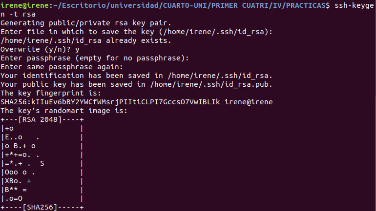

## CONFIGURACIÓN DE GIT
Para configurar nuestro nombre de usuario y correo electrónico hemos hecho uso de los comandos:
~~~
git config --global user.name "Irene Cano Jerez"
git config --global user.email "irenecanjer@correo.ugr.es"
~~~

Además, indicamos que vamos a usar como editor Atom, para ello ejecutamos lo siguiente:
~~~
git config --global core.editor "atom --wait"
~~~

Con esto ya tenemos git configurado, como podemos ver en la siguiente imagen:

## GENERAR PAR DE CLAVES PÚBLICA Y PRIVADA
A continuación tenemos que generar una clave pública, la cual subiremos a GitHub para así poder trabajar haciendo uso de SSH.
Para obtener dicha clave hemos hecho uso del siguiente comando:
~~~
ssh-keygen -t rsa
~~~

De manera que en el directorio */home/irene/.ssh/id_rsa* tendremos nuestra clave privada y en */home/irene/.ssh/id_rsa.pub* se encuentra la clave pública.

Ahora debemos situarnos en el directorio donde está la clave pública y acceder a *id_rsa.pub* para poder copiar la clave.

Una vez tenemos la clave, nos dirigimos a GitHub, seleccionamos nuestro perfil, pulsamos en 'Settings' y elegimos 'SSH and GPG keys'. Aquí hacemos click en 'New SSH key', le ponemos un título y pegamos nuestra clave pública.

