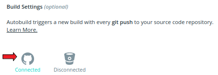
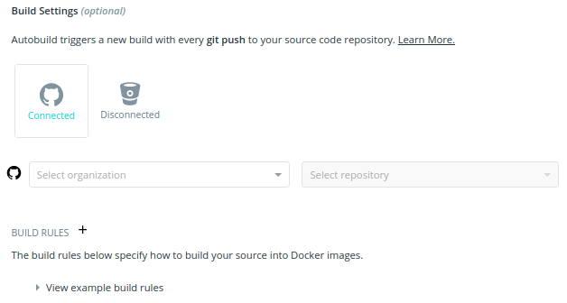
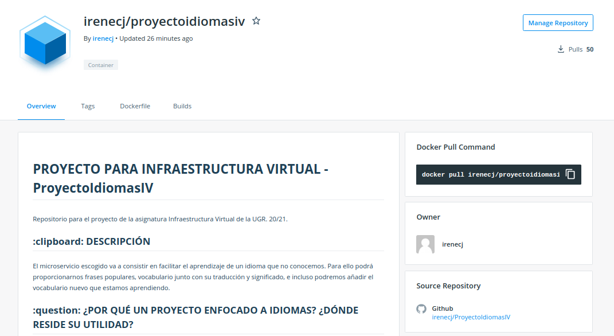

# PASOS PARA SUBIR CORRECTAMENTE NUESTRO CONTENEDOR A DOCKER HUB
Lo primero que debemos hacer es acceder a [Docker Hub](https://hub.docker.com/) y crearnos una cuenta si no estamos aún registrados.

Una vez creada la cuenta, debemos crear un nuevo repositorio y configurarlo para que se sincronice con nuestro repositorio de GitHub, por lo que debemos llamar al nuevo repositorio igual que el que tenemos en GitHub pero sin usar mayúsculas, poniéndolo todo en minúsculas.
En mi caso el repositorio en Docker Hub se llama **irenecj/proyectoidiomasiv.** Opcionalmente podemos añadir una descripción.

Como queremos que nuestro repositorio sea público dejamos marcada la visibilidad *public* y a continuación vinculamos nuestra cuenta de GitHub haciendo click en el símbolo de dicha plataforma.

Una vez conectados volvemos a pulsar en el icono y nos aparecen más ajustes.

Aquí podemos indicar nuestro repositorio de GitHub, de manera que ambos repositorios quedarán vinculados y cuando ejecutemos **git push** en nuestro repositorio local, también se nos actualizará el repositorio de Docker Hub. Debemos tener en cuenta que tanto el proceso de actualización como la creación del repositorio requieren un tiempo de espera.

Y de esta forma tendremos nuestro repositorio en Docker Hub.

