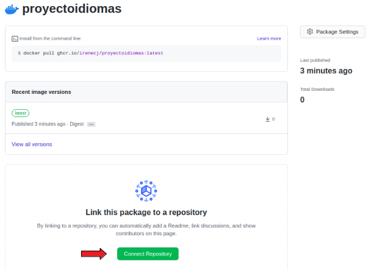

# PASOS PARA SUBIR CORRECTAMENTE NUESTRO CONTENEDOR A GITHUB CONTAINER REGISTRY
Para proceder a subir nuestro contenedor a GitHub Container Registry he seguido la [guía oficial.](https://docs.github.com/en/free-pro-team@latest/packages/getting-started-with-github-container-registry/migrating-to-github-container-registry-for-docker-images)
En resumen, los pasos que debemos seguir son los siguientes:
1. Debemos renombrar nuestra imagen y ponerle el dominio para el registro de contenedor de GitHub, de tal forma, que en nuestro caso el comando sería el siguiente:

  ~~~
  docker tag <NOMBRE DE NUESTRA IMAGEN> ghcr.io/PROPIETARIO/NOMBRE_IMAGEN
  ~~~
2. Una vez hemos renombrado nuestra imagen pasamos a registrarnos en el registro de contenedores. Para ello, en la página mencionada nos recomiendan crearnos un token de acceso, el cual podemos obtener en GitHub, dirigiéndonos al apartado 'Settings' - 'Developer Settings' - 'Personal access tokens'. Dicho token lo guardamos en una variable de entorno y a continuación iniciamos sesión en el servicio de registro de contenedores de GitHub.

  ~~~
  export TOKEN=<NUESTRO-TOKEN>

  echo $TOKEN | docker login ghcr.io -u USUARIO-GITHUB --password-stdin
  ~~~

3. Finalmente hacemos push de nuestra imagen renombrada al registro de contenedores.
  ~~~
  docker push ghcr.io/PROPIETARIO/NOMBRE_IMAGEN:VERSION
  ~~~

Una vez tenemos la imagen en GitHub Container Registry debemos cambiarle la visibilidad a *pública* y sincronizarla con nuestro repositorio de GitHub. Para ello accedemos al [contenedor](https://github.com/users/irenecj/packages/container/package/proyectoidiomas), nos dirigimos a *package settings* y le damos a *make this package public* e introducimos el nombre del contenedor.

Para sincronizarlo con nuestro repositorio, hacemos click en *connect repository*, como aparece en la imagen, y elegimos el repositorio correspondiente, y ya tendríamos nuestro contenedor correctamente subido a GitHub Container Registry.

