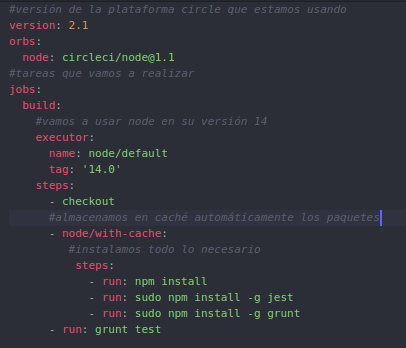
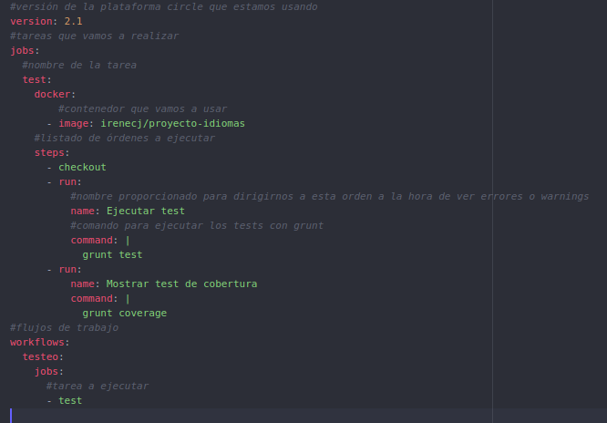
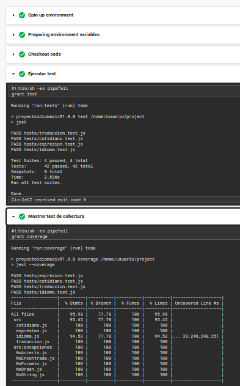

# INTEGRACIÓN CONTINUA CON CIRCLE CI

## ¿QUÉ ES CIRCLE CI?
CircleCI es una plataforma de integración continua el cual hoy en día se usa para probar productos software que se encuentran en Bitbucket y GitHub.

## ¿POR QUÉ ELEGIMOS CIRCLE CI COMO ALTERNATIVA A TRAVIS?
Si comparamos ambas plataformas nos encontramos dos principales diferencias:
-  La primera de ellas es que Travis es una máquina virtual la cual está prediseñada con varias herramientas que vienen preinstaladas. Sin embargo, CircleCI trabaja con Dcoker, por lo que nos permite tener imágenes de cualquier plataforma.
- La segunda diferencia es que Circle CI permite crear flujos de trabajo, por lo que podemos tener varios trabajos en paralelo, de manera que nos podremos ahorrar tiempo. Esto tiene otro beneficio, y es que en el caso de que ºse produzca un error, como tendremos los diferentes procesos separados de manera independiente, será más fácil identificar dónde se encuentra dicho error.

## INTEGRACIÓN CONTINUA EN NUESTRO PROYECTO

### SIN HACER USO DE CONTENEDORES

Vemos que nada más empezar indicamos la versión de CircleCI que vamos a utilizar. A continuación tenemos la orden *orbs* en la que tenemos paquetes de código abierto que tienen elementos de configuración que podemos reutilizar como los *jobs*, *commands* o *executors*.

Ahora indicamos los trabajos que vamos a realizar, en nuestro caso sólo tenemos la tarea *build* en la que indicamos que la tarea se ejecutará haciendo uso de node en su versión 14.
Los pasos que vamos a realizar son hacer un *checkout* y una vez hecho este, procederemos a instalar los paquetes necesarios, que se instalarán automáticamente en la caché, para así reducir los tiempos de instalación.

Procedemos a instalar todas las dependencias, y globalmente instalamos Jest para testear, y nuestro gestor de tareas. Las instalaciones globales se hacen con *sudo* para evitar errores con los permisos.

Finalmente, lanzamos los tests con Grunt.

Esta configuración podemos ver que pasa correctamente los tests.

### USANDO EL CONTENEDOR DE DOCKER HUB

Cuando usamos nuestro contenedor de Docker Hub, el fichero de configuración cambia un poco. En primer lugar, ahora no necesitamos poner *orbs* ya que simplemente vamos a descargarnos un contenedor, y a lanzar los tests con nuestro gestor de tareas, es decir, todo lo necesario se encuentra en nuestro contenedor.

En *jobs* establecemos los trabajos que vamos a realizar, y volvemos a tener sólo una, llamada *test*. DEntro de esta tarea lo primero que hacemos es descargarnos nuestro contenedor haciendo uso de docker. Una vez hecho esto, los pasos que debemos seguir son: realizar un *checkout* y a continuación ejecutar los tests con nuestro gestor de tareas.

Una duda que me surgió era por qué usamos **grunt test** y no **docker run -t -v**, y esto se debe a que cuando ponemos *image: <contenedor>* lo que hacemos es introducirnos dentro del contenedor.

Además, en nuestro [Gruntfile](https://github.com/irenecj/proyecto-idiomas/blob/master/Gruntfile.js) hemos añadido una tarea para poder mostrar el test de cobertura.

Finalmente establecemos un flujo de trabajo, en el que crearemos otra tarea, llamada *testeo*, que consistirá en ejecutar la tarea creada anteriormente, la tarea *test*.

Podemos apreciar una **diferencia que me resultó curiosa** respecto al fichero de configuración anterior, y es que los flujos de trabajo no aparecen. Esto se debe a que tenemos una única tarea, y el uso de *workflows* es más común cuando tenemos una colección de trabajos.

Podemos ver, que este fichero de configuración también tuvo un resultado con éxito.

## ENLACES CONSULTADOS
Voy a dejar algunos de los enlaces que he consultado ya que aprender a usar CircleCI me ha parecido un poco más complicado que TravisCI, y hay que buscar bastante documentación para poder diseñar un fichero de configuración correcto.
- [Getting Started.](https://circleci.com/docs/2.0/getting-started/#section=getting-started)
- [Explicación más detallada.](https://circleci.com/docs/2.0/config-intro/)
