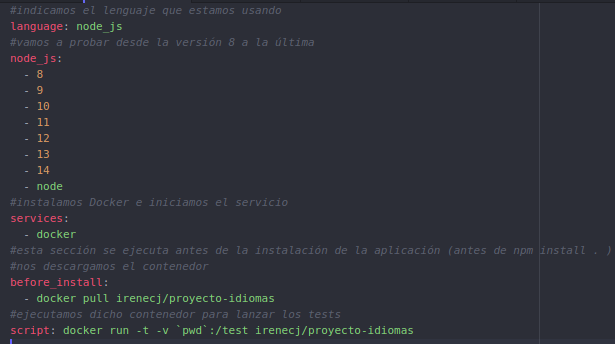
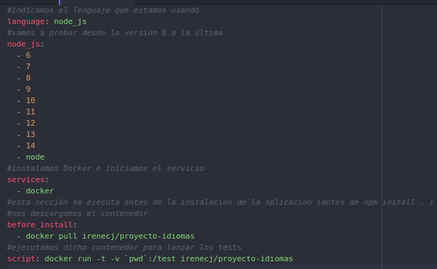

# EXPLICACIÓN SOBRE LOS FICHEROS DE CONFIGURACIÓN DE TRAVIS USADOS

## SIN HACER USO DE UN CONTENEDOR

En primer lugar establecemos el lenguaje que vamos a usar en nuestro proyecto, a continuación, ponemos las versiones de dicho lenguaje que vamos a testear. Como ya hemos comentado en este [fichero de documentación](https://github.com/irenecj/proyecto-idiomas/blob/master/docs/travis/CI-travis.md), primero hemos probado de el rango de versiones desde la 8 hasta la última, y después hemos añadido la 6 y la 7 para ver hasta qué versión tenía soporte nuestra aplicación.

**Anotación:** para indicar en el fichero de configuración que queremos testear la última versión es suficiente con poner *node* en la sección de versiones. Al igual ocurre con la versión LTS más reciente, podemos referirnos a ella poniendo  _lts / *_

Ahora tenemos la sección *before_install* la cual se ejecutará antes de la instalación de la aplicación, es decir, antes de ejecutar **npm install .**. En nuestro caso, instalaremos Jest para testear, y Grunt como gestor de tareas.

Finalmente, nos encontramos la sección *script* en la que indicamos como ejecutar los tests haciendo uso del gestor de tareas.

## HACIENDO USO DEL CONTENEDOR DE DOCKER HUB

### SIN UTILIZAR LA VERSIÓN "MINIMAL"

En este caso, las primeras secciones se quedan igual, establecemos el lenguaje usado y las versiones de dicho lenguaje que vamos a probar.
Ahora añadimos una nueva sección respecto a la anterior llamada *services*. En indicamos que se proceda a la instalación de *Docker* y que se inicie el servicio.
Una vez hecho esto, antes de ejecutar la instalación debemos descargarnos nuestra contenedor y después, procedemos a ejecutar los tests haciendo uso de él.

### UTILIZANDO LA VERSIÓN MINIMAL

Como hemos comentado en el [documento anterior]((https://github.com/irenecj/proyecto-idiomas/blob/master/docs/travis/CI-travis.md), como nuestro contenedor ya tiene todo aquello que necesita el lenguaje para poder funcionar, vamos a usar la versión *minimal* de Travis.
En este caso, el fichero de configuración es exactamente igual que los anteriores, sólo que en *language* indicamos que estamos usando la versión *minimal* y la sección donde especificamos las versiones que vamos a probar ya no es necesaria.
