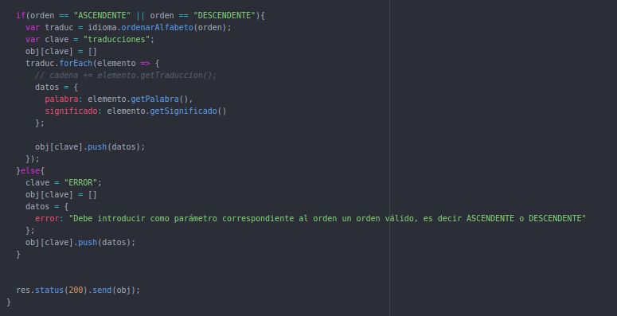

# DESPLIEGUE DEL PROYECTO CON VERCEL
Para poder desplegar nuestro repositorio en **Vercel** nos hemos regido por la [documentación oficial](https://vercel.com/docs/git/vercel-for-github) del sitio.

Antes de comenzar, para comprobar que funciona correctamente, vamos a añadir el directorio **api** y dentro de este un ejemplo de función llamado **hello.js**.

Para registrarnos en **Vercel** simplemente debemos vincular nuestra cuenta de GitHub y a continuación, importamos nuestro repositorio.

**Aclaración:** podemos pensar por un momento que seleccionar todo nuestro proyecto no es una buena opción ya que cada vez que hagamos un **deploy** se va a desplegar el proyecto entero y por tanto estaremos consumiendo mucha memoria en Vercel, sin embargo, si no hacemos esto y añadimos sólo la carpeta que incluya nuestra funciones, no estaremos teniendo en cuenta que puede que alguna de estas funciones necesiten hacer uso de otros archivos que probablemente se encuentren en otros directorios.

Lo próximo que debemos hacer es lanzar Vercel con el siguiente comando e indicarle que queremos linkarlo al repositorio que tenemos en Vercel:
~~~
vercel
~~~

**Aclaración:** si no tenemos instalado Vercel, simplemente debemos ejecutar el comando **npm install -g vercel**.

Con esto hecho, podemos proceder a ejecutar la siguiente orden para finalizar nuestro despliegue:
~~~
vercel --prod
~~~

Podemos ver que el proyecto se ha desplegado correctamente

**Despliegue continuo:** cada vez que hagamos **git push** a nuestro proyecto se nos actualizará el repositorio tanto en GitHub como en [Vercel](https://proyecto-idiomas.vercel.app/).

## COMPROBACIÓN DE FUNCIONAMIENTO CORRECTO USANDO UNA FUNCIÓN DE EJEMPLO
Como ya hemos comentado al principio, hemos creado el fichero **hello.js** que contiene la siguiente función de prueba:

A continuación hacemos **git push** y nos dirigimos a nuestro repositorio en Vercel para ver que se muestra el mensaje deseado por pantalla.

**Aclaración:** el funcionamiento correcto de nuestro ejemplo podemos verlo en cualquier momento mientras dispongamos de [este enlace](https://proyecto-idiomas-5tf0id7p5.vercel.app/api/hello.js).

## IMPLEMENTACIÓN DE UNA FUNCIÓN
La función que vamos a implementar se llama **ordenarAlfabeto(orden)** y corresponde a la [HU8.](https://github.com/irenecj/proyecto-idiomas/issues/25) Esta función se encarga de devolvernos una lista de las palabras junto con su significado, según el orden que le indiquemos, es decir, de manera ascendente o descendente.
Como comento en [este issue](https://github.com/irenecj/proyecto-idiomas/issues/46) he elegido desplegar dicha función ya que me parece que no es tan simple como mostrar sólo la lista de palabras sin más ya que para llevar a cabo la implementación debemos ver cómo se pasan los parámetros por la URL, comprobar si el parámetro se ha introducido con un formato correcto y es un orden válido, y en caso contrario mostrar un mensaje de error y después mostramos la lista.

Veamos todo esto con más detalle. En primer lugar, hemos creado un fichero [data.json](https://github.com/irenecj/proyecto-idiomas/blob/master/api/data/data.json) donde tenemos tanto nuestras palabras y su significado, como las expresiones populares y las frases cotidianas, y de dicho fichero vamos a recuperar los datos con los que formaremos nuestra respuesta.

Pasamos a analizar el código.

En primer lugar debemos hacer los *require* a nuestro fichero de datos y a la clase *idioma* ya que en ella tenemos las funciones necesarias para la integrar dicha función con nuestro código.
Nuestra función se va a basar en que a partir del orden que se le proporcione mediante la url, nos mostrará un listado del vocabulario registrado de manera ascendente o descendente, por lo que lo primero que debemos hacer es leer nuestro fichero **data.json** e ir añadiendo las palabras que vayamos encontrando junto con su significado, para así tenerlas todas almacenadas en un vector, llamado *listado*.

En el caso de que el orden introducido sea válido procedemos a ordenar el resultado. Para ello debemos crear un json, que enviaremos como respuesta, y que contendrá el listado ordenado. Simplemente debemos recorrer las traducciones ya ordenadas e ir creando nuestro diccionario, cuya clave es *traducciones*, con las palabras en el orden correspondiente.
En el caso en que el orden que se introduzca no sea válido, por ejemplo *numérico*, devolveremos un json el cual nos va a indicar que hay un error y que sólo podemos introducir como orden *ASCENDENTE* o *DESCENDENTE* en ese formato.

Finalmente enviamos como respuesta nuestro objeto. Para probar que esto funciona simplemente debemos acceder a [este enlace](https://proyecto-idiomas-pa6dmtqdu.vercel.app/api/ordenar.js?orden=ASCENDENTE) y vemos como la lista aparece ordenada de manera ascendente. Si queremos corroborar que funciona también de manera descendente simplemente usamos [este otro enlace.]((https://proyecto-idiomas-pa6dmtqdu.vercel.app/api/ordenar.js?orden=DESCENDENTE)

