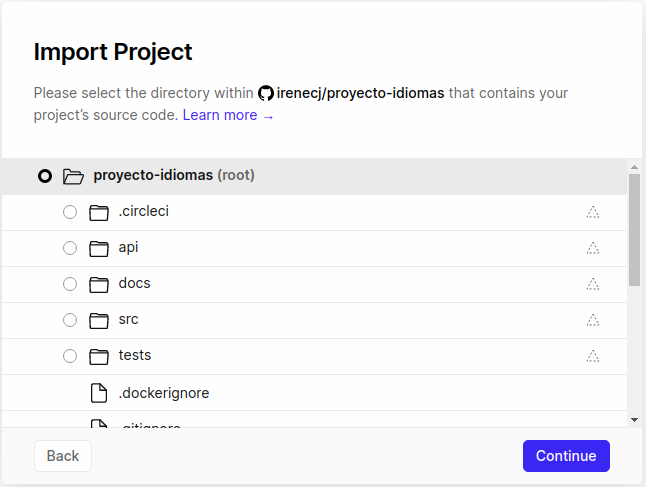
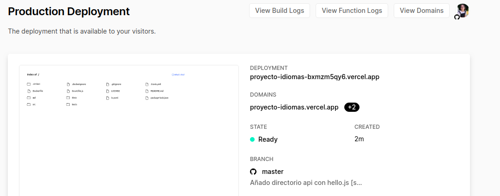

### DESPLIEGUE DEL PROYECTO CON VERCEL
Para poder desplegar nuestro repositorio en Vercel nos hemos regido por la [documentación oficial](https://vercel.com/docs/git/vercel-for-github) del sitio.

Antes de comenzar, para comprobar que funciona correctamente, vamos a añadir el directorio **api** y dentro de este un ejemplo de función llamado **hello.js**.

Para registrarnos en **Vercel** simplemente debemos vincular nuestra cuenta de GitHub y a continuación, importamos nuestro repositorio.

**Aclaración:** podemos pensar por un momento que seleccionar todo nuestro proyecto no es una buena opción ya que cada vez que hagamos un **deploy** se va a desplegar el proyecto entero y por tanto estaremos consumiendo mucha memoria en Vercel, sin embargo, si no hacemos esto y añadimos sólo la carpeta que incluya nuestra funciones, no estaremos teniendo en cuenta que puede que alguna de estas funciones necesiten hacer uso de otros archivos que probablemente se encuentren en otros directorios.

Lo próximo que debemos hacer es lanzar Vercel con el siguiente comando e indicarle que queremos linkarlo al repositorio que tenemos en Vercel:
~~~
vercel
~~~

**Aclaración:** si no tenemos instalado Vercel, simplemente debemos ejecutar el comando **npm install -g vercel**.

Con esto hecho, podemos proceder a ejecutar la siguiente orden para finalizar nuestro despliegue:
~~~
vercel --prod
~~~

Podemos ver que el proyecto se ha desplegado correctamente

**Despliegue continuo:** cada vez que hagamos **git push** a nuestro proyecto se nos actualizará el repositorio tanto en GitHub como en [Vercel](https://proyecto-idiomas.vercel.app/).
