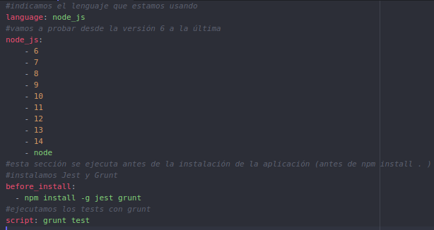
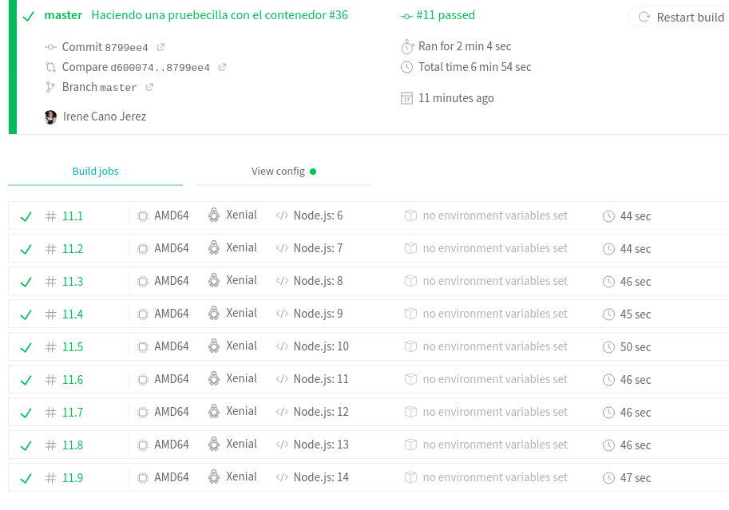

# INTEGRACIÓN CONTÍNUA CON TRAVIS

## SIN HACER USO DE CONTENEDORES
Vamos a hacer uso de [Travis](https://travis-ci.com/) para poder ver qué versiones del lenguaje que uso en mi aplicación funcionan adecuadamente, es decir, vamos a testear diversas versiones de *Node*.

En primer lugar decidí ver si funcionaban las versiones en el rango desde la 8 hasta la 14, ¿por qué este rango de versiones?. De la 10 a la 14 ya que podemos decir que son las más "actuales" e incluso las que más se usan hoy en día, aunque aquellas versiones que sean impares, como la 11 y la 13, son menos recomendables ya que no tienen LTS, por lo que pasado 1 año se quedarán sin soporte.
En esta [página](https://github.com/nodejs/Release) tenemos una imagen donde nos aparece una tabla acompañada de una imagen donde se representa esto.
He querido probar también con la 8 y la 9 ya que me parece interesante saber si dichas versiones, las cuales podemos considerar menos recientes, ya que surgieron en torno a 2017, son soportadas.

Nuestro primer fichero de configuración quedó de la siguiente forma:

Y el resultado que obtuvimos fue:

Vemos que nuestra aplicación funciona correctamente para todo el rango de versiones elegido.

Visto este resultado, decidí ampliar un poco más el rango, incluyendo las versiones 6 y 7, y sospechando que estas probablemente no serían soportadas.
Efectivamente, cuando actualizamos nuestro fichero *.travis.yml* en el resultado obtenido queda reflejado como a partir de la versión 7 de *node* nuestro proyecto deja de funcionar.

## USANDO EL CONTENEDOR DE DOCKER HUB
Como vemos, el fichero de configuración que hemos utilizado no aprovecha el contenedor que creamos en Docker Hub, por tanto, vamos a probar el primer rango de versiones anterior para ver si todo sigue funcionando correctamente.

En el resultado vemos que todo funciona correctamente para todas las versiones. En este punto, comprendí que nuestro contenedor de Docker ejecuta el comando **apk add --update nodejs**, ya que uso un contenedor con Alpine como sistema operativo, de manera que instalo la última versión de Node. Por este motivo, los tests no dependerán de la versión que indiquemos en el fichero de configuración ya que el contenedor tiene su propia versión del lenguaje y por tanto funciona correctamente.

Para comprobar esto, recordamos que anteriormente probamos también las versiones 6 y 7 y demostramos que nuestro proyecto no funciona con dichas versiones. Sin embargo, al probar dichas versiones haciendo uso del contenedor nos encontramos el siguiente resultado:

Vemos que como hemos comentado, todo funciona perfectamente en **todas** las versiones, debido a que nuestro contenedor tiene instalada la última versión de Node.

**Explicación de los ficheros de configuración usados** en el siguiente [enlace.](https://github.com/irenecj/proyecto-idiomas/blob/master/docs/travis/pruebas-travis.md)
